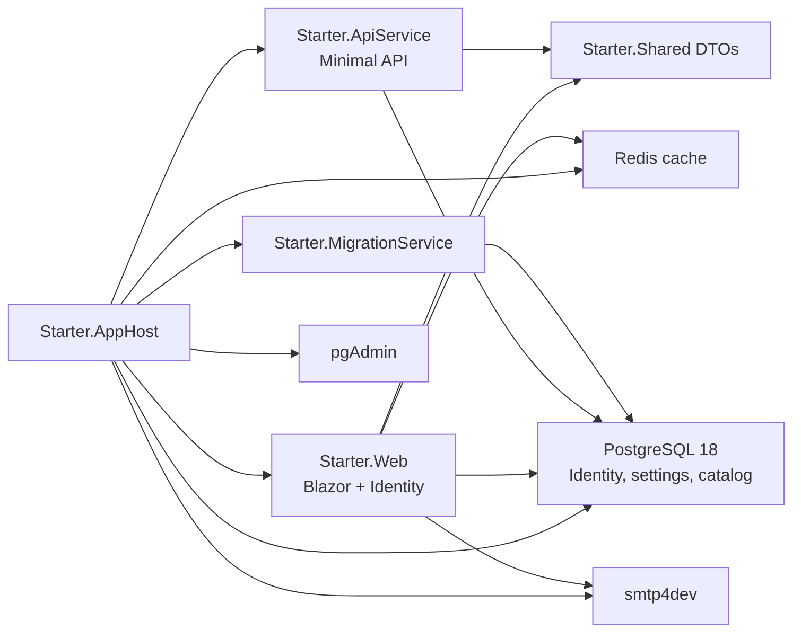

# Starter


An opinionated .NET 10 Aspire app foundation for building internal tools, admin portals, and full-stack line-of-business apps without spending the first day wiring infrastructure.


## Why This App

This repository was generated from an enhanced Aspire application template. It includes the pieces most teams add immediately: identity, roles, admin pages, PostgreSQL, Redis, migrations, local email capture, typed DTOs, a Minimal API, a Blazor frontend, and an integration test that starts the distributed app.

Template version: `0.1.10`. The same value is available in `Starter.Shared.TemplateInfo.Version`.

## Included

| Area | Included |
| --- | --- |
| App orchestration | .NET Aspire AppHost with Redis, PostgreSQL 18, pgAdmin, smtp4dev, API, Web, and migration service |
| Frontend | Blazor Web App, Interactive Server render mode, MudBlazor shell, module navigation, dark mode |
| Backend | Minimal API with service discovery and OpenAPI in Development |
| Data | PostgreSQL shared by API and Web, EF Core migrations, development seed data |
| Identity | ASP.NET Core Identity, seeded admin/manager/user accounts, roles, permissions, feature flags |
| Account flows | Self registration, configurable email confirmation, forgot/reset password |
| Admin | Users, roles, permissions, features, and system configuration |
| Email | SMTP settings, protected SMTP secret storage, smtp4dev local inbox |
| Developer samples | Copyable catalog master-detail slice with shared DTOs and database-backed API endpoints |
| Quality | GitHub Actions CI and local/manual Aspire integration smoke test |

## Architecture



## Quick Start

Prerequisites:

- .NET 10 SDK
- Docker Desktop or another Docker-compatible runtime
- Aspire CLI

Start the full local stack:

```powershell
aspire start --apphost Starter.AppHost/Starter.AppHost.csproj
```

Common local URLs:

| Service | URL |
| --- | --- |
| Web | `https://localhost:7131` |
| Starter workspace | `https://localhost:7131/` |
| Catalog CRUD sample | `https://localhost:7131/dev/catalog` |
| pgAdmin | `http://localhost:5050` |
| smtp4dev | `http://localhost:5080` |
| Aspire Dashboard | Shown by `aspire start` |

pgAdmin is configured for local development with server mode and master password prompts disabled. If a login prompt appears, use `admin@domain.com` / `Happy1..`.

If a port changes, check the Aspire dashboard or run:

```powershell
aspire describe --apphost Starter.AppHost/Starter.AppHost.csproj
```

## Seeded Accounts

The migration service seeds local test users in Development:

| Email | Role | Password |
| --- | --- | --- |
| `admin@starter.local` | Administrator | `Happy1..` |
| `manager@starter.local` | Manager | `Happy1..` |
| `user@starter.local` | User | `Happy1..` |

Open `/admin/login` or use the app bar login button.

## Admin And Configuration

The Admin module includes:

- Dashboard
- Users
- Roles
- Permissions
- Features
- System settings

System settings are stored in the `Settings` table and seeded from `Starter.Web/Services/SystemConfigurationService.cs`.

Useful runtime settings include:

- Self registration
- Require email confirmation
- Display development confirmation/reset links
- Public base URL
- SMTP delivery, host, port, SSL, username, password/API key

Secret settings, such as SMTP password or API key, are protected with ASP.NET Core Data Protection before being stored.

## Local Email

The AppHost runs smtp4dev so account emails can be tested without an external SMTP server.

Development defaults:

- Email delivery enabled
- SMTP host/port seeded from the Aspire smtp4dev endpoint
- SMTP SSL disabled
- SMTP username/password blank
- From address `no-reply@starter.local`

Use `http://localhost:5080` to view captured messages. Forgot password and email confirmation flows are both wired to the configured account email sender.

## Catalog CRUD Module

The Catalog CRUD module is a copyable master-detail vertical slice:

- DTOs: `Starter.Shared/CatalogDtos.cs`
- Entities: `Starter.ApiService/Data/CatalogCategory.cs`, `Starter.ApiService/Data/CatalogProduct.cs`
- EF configuration: `Starter.ApiService/Data/CatalogDbContext.cs`
- Migration: `Starter.ApiService/Data/Migrations/*_CatalogCrud.cs`
- Sample data: `Starter.ApiService/Data/CatalogSeedExtensions.cs`
- API endpoints: `Starter.ApiService/CatalogEndpoints.cs`
- Web client: `Starter.Web/CatalogApiClient.cs`
- Blazor page: `Starter.Web/Components/Pages/Dev/Crud.razor`
- Navigation: `Starter.Web/Components/Pages/Dev/DevNav.razor`

API endpoints:

```text
GET    /dev/catalog/categories
POST   /dev/catalog/categories
PUT    /dev/catalog/categories/{id}
DELETE /dev/catalog/categories/{id}

GET    /dev/catalog/products
POST   /dev/catalog/products
PUT    /dev/catalog/products/{id}
DELETE /dev/catalog/products/{id}
```

To create a real feature module, keep the UI in Web, own the data model and EF migration in ApiService, and share request/response DTOs through Starter.Shared. The migration service seeds catalog sample data in Development; set `Catalog:Seed:SampleData=false` to disable it.

## Project Layout

```text
Starter.AppHost            Aspire orchestration
Starter.ApiService         Minimal API backend
Starter.Web                Blazor Web App, Identity, admin, dev pages
Starter.Shared             DTOs shared by API and Web
Starter.MigrationService   EF migrations and seed data
Starter.ServiceDefaults    Aspire service defaults
Starter.Tests              Aspire integration tests
```

## Useful Commands

Build everything:

```powershell
dotnet build Starter.slnx
```

Run tests:

```powershell
dotnet test Starter.slnx
```

The test project starts the Aspire AppHost and pulls Docker images for PostgreSQL, Redis, pgAdmin, and smtp4dev. GitHub Actions runs restore/build on every push and pull request; the Docker-backed Aspire smoke test is available from manual workflow dispatch to avoid public-runner Docker Hub 429 rate limits.

Start Aspire:

```powershell
aspire start --apphost Starter.AppHost/Starter.AppHost.csproj
```

Stop Aspire:

```powershell
aspire stop --apphost Starter.AppHost/Starter.AppHost.csproj
```

Rebuild one running resource:

```powershell
aspire resource webfrontend rebuild --apphost Starter.AppHost/Starter.AppHost.csproj --non-interactive
```

Add a migration:

```powershell
dotnet ef migrations add MigrationName --project Starter.Web/Starter.Web.csproj --startup-project Starter.Web/Starter.Web.csproj --context ApplicationDbContext --output-dir Data/Migrations
```

## Development Vs Production Defaults

Development is intentionally convenient:

- Self registration enabled
- Email delivery enabled through smtp4dev
- Password reset links can be displayed on screen
- Email confirmation links can be displayed on screen when confirmation is enabled
- Seeded users available with a simple shared password

Production defaults are more conservative:

- Self registration disabled
- Email delivery disabled until configured
- Development confirmation/reset links disabled

## Search Keywords

`dotnet aspire starter`, `aspire template`, `blazor admin starter`, `aspnet core identity`, `mudblazor dashboard`, `postgresql aspire`, `minimal api starter`, `smtp4dev`, `ef core migrations`, `redis output cache`.

## License

MIT
