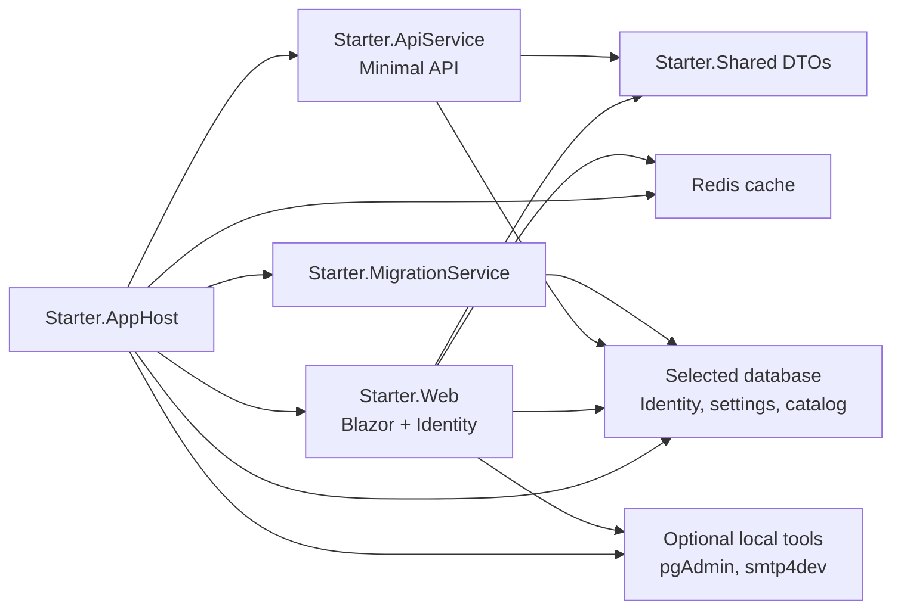

# Starter


A polished .NET 10 Aspire admin starter for internal tools, admin portals, and full-stack business apps. It gives you the infrastructure most projects need on day one: authentication, role-based admin pages, runtime settings, a database provider, Redis, optional local email capture, migrations, a Minimal API, a Blazor frontend, shared DTOs, and a real database-backed CRUD slice.


## Why This App

This application was generated from an enhanced Aspire template. It includes the foundation most teams add early: identity, roles, admin pages, runtime settings, a database provider, Redis, migrations, optional local email capture, typed DTOs, a Minimal API, a Blazor frontend, and an integration test that starts the distributed app.

Template version: `0.1.15`. The same value is available in `Starter.Shared.TemplateInfo.Version`.

| What you need | Already included |
| --- | --- |
| Local orchestration | Aspire AppHost with PostgreSQL or SQL Server, Redis, optional local tools, API, Web, and migration service |
| Authentication | ASP.NET Core Identity, seeded test accounts, self registration, email confirmation, forgot/reset password |
| Authorization | Admin roles, permissions, feature flags, policy-protected admin pages |
| Admin UI | Dashboard, users, roles, permissions, features, and system configuration |
| Configuration | Runtime settings stored in the database, including SMTP and account-flow options |
| Data path | EF Core migrations, API-owned catalog schema, shared DTOs, Blazor CRUD UI |
| Developer loop | Optional local tool UIs, Redis output cache, Aspire dashboard, smoke test |

## Five-Minute Start

Prerequisites:

- .NET 10 SDK
- Aspire CLI
- Docker Desktop or another Docker-compatible runtime

Run the full stack from the solution directory:

```powershell
aspire start --apphost Starter.AppHost/Starter.AppHost.csproj
```

Then open the URL shown by Aspire. The default local web endpoint is usually:

```text
https://localhost:7131
```

Useful local URLs:

| Area | URL |
| --- | --- |
| Workspace dashboard | `https://localhost:7131/` |
| Admin login | `https://localhost:7131/admin/login` |
| Catalog CRUD sample | `https://localhost:7131/dev/catalog` |
| pgAdmin | `http://localhost:5050` when PostgreSQL pgAdmin is enabled |
| smtp4dev inbox | `http://localhost:5080` when local email capture is enabled |
| Aspire dashboard | Printed by `aspire start` |

If a port changes, ask Aspire:

```powershell
aspire describe --apphost Starter.AppHost/Starter.AppHost.csproj
```

## Default Accounts

The migration service seeds local users in Development when test user seeding is enabled:

| Email | Role | Password |
| --- | --- | --- |
| `admin@starter.local` | Administrator | `Happy1..` |
| `manager@starter.local` | Manager | `Happy1..` |
| `user@starter.local` | User | `Happy1..` |

Open `/admin/login` or use the login button in the app bar.

## Architecture



The application is intentionally split the way a real Aspire app usually grows:

| Project | Responsibility |
| --- | --- |
| `Starter.AppHost` | Aspire orchestration and local resources |
| `Starter.ApiService` | Minimal API backend and API-owned catalog data |
| `Starter.Web` | Blazor Web App, Identity, admin module, settings, dev pages |
| `Starter.Shared` | DTOs shared by API and Web |
| `Starter.MigrationService` | EF Core migrations and seed data |
| `Starter.ServiceDefaults` | Health checks, telemetry, service discovery, resilience |
| `Starter.Tests` | Aspire integration smoke test |

## Admin And Settings

The Admin module is meant to be useful immediately and easy to replace later.

Included tabs:

- Dashboard
- Users
- Roles
- Permissions
- Features
- System settings

System settings are stored in the database and seeded by `Starter.Web/Services/SystemConfigurationService.cs`. They include:

- Self registration
- Require email confirmation
- Display development confirmation/reset links
- Public base URL
- SMTP delivery, host, port, SSL, username, password/API key

Secret values are protected with ASP.NET Core Data Protection before they are stored.

## Local Email

When smtp4dev is enabled, account email flows work locally without an external SMTP server.

Development defaults:

- Email delivery enabled
- SMTP host and port can be supplied by the Aspire smtp4dev resource
- SMTP SSL disabled
- SMTP username/password blank
- From address `no-reply@starter.local`

Use `http://localhost:5080` to inspect captured messages. Forgot password and email confirmation are both wired through the same account email sender.

## Catalog CRUD Slice

The Catalog module demonstrates the recommended shape for a real feature: API owns the data model, Web owns the UI, and Shared owns the DTO contract.

| Layer | Files |
| --- | --- |
| DTOs | `Starter.Shared/CatalogDtos.cs` |
| Entities | `Starter.ApiService/Data/CatalogCategory.cs`, `Starter.ApiService/Data/CatalogProduct.cs` |
| EF Core | `Starter.ApiService/Data/CatalogDbContext.cs`, `Starter.ApiService/Data/Migrations/*_CatalogCrud.cs` |
| Seed data | `Starter.ApiService/Data/CatalogSeedExtensions.cs` |
| API | `Starter.ApiService/CatalogEndpoints.cs` |
| Web client | `Starter.Web/CatalogApiClient.cs` |
| Blazor page | `Starter.Web/Components/Pages/Dev/Crud.razor` |
| Navigation | `Starter.Web/Components/Pages/Dev/DevNav.razor` |

API endpoints:

```text
GET    /dev/catalog/categories
POST   /dev/catalog/categories
PUT    /dev/catalog/categories/{id}
DELETE /dev/catalog/categories/{id}

GET    /dev/catalog/products
POST   /dev/catalog/products
PUT    /dev/catalog/products/{id}
DELETE /dev/catalog/products/{id}
```

Use this slice as the copy-and-rename pattern for the first real module in your app.

## Common Commands

Build:

```powershell
dotnet build Starter.slnx
```

Run tests:

```powershell
dotnet test Starter.slnx
```

Start Aspire:

```powershell
aspire start --apphost Starter.AppHost/Starter.AppHost.csproj
```

Stop Aspire:

```powershell
aspire stop --apphost Starter.AppHost/Starter.AppHost.csproj
```

Rebuild one running resource:

```powershell
aspire resource webfrontend rebuild --apphost Starter.AppHost/Starter.AppHost.csproj --non-interactive
```

Add an Identity/Admin migration:

```powershell
dotnet ef migrations add MigrationName --project Starter.Web/Starter.Web.csproj --startup-project Starter.Web/Starter.Web.csproj --context ApplicationDbContext --output-dir Data/Migrations
```

Add a Catalog/API migration:

```powershell
dotnet ef migrations add MigrationName --project Starter.ApiService/Starter.ApiService.csproj --startup-project Starter.ApiService/Starter.ApiService.csproj --context CatalogDbContext --output-dir Data/Migrations
```

## Development And Production Defaults

Development is intentionally convenient:

- Self registration enabled
- Optional local email capture through smtp4dev
- Password reset links can be displayed on screen
- Email confirmation links can be displayed on screen when confirmation is enabled
- Seeded users available with a simple shared password

Production defaults are more conservative:

- Self registration disabled
- Email delivery disabled until configured
- Development confirmation/reset links disabled

Before production, set real SMTP settings, change seed credentials, choose your registration policy, configure persistent hosting storage, and review role/permission names for your domain.

## Search Keywords

`dotnet aspire starter`, `aspire template`, `blazor admin starter`, `aspnet core identity`, `mudblazor dashboard`, `database-backed aspire`, `minimal api starter`, `smtp4dev`, `ef core migrations`, `redis output cache`.

## License

MIT
